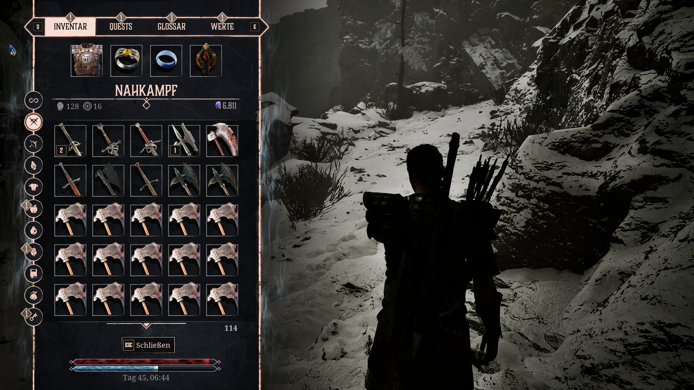
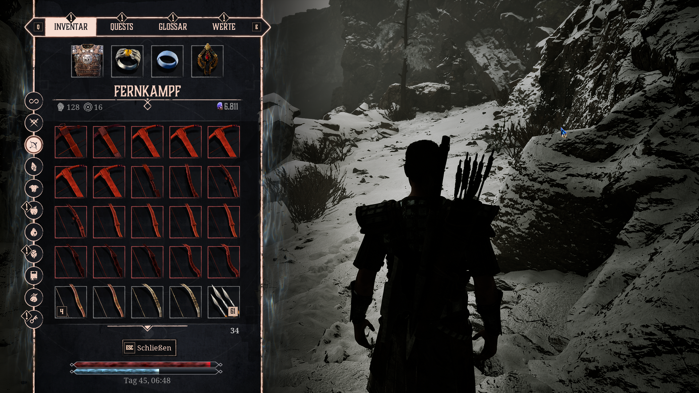
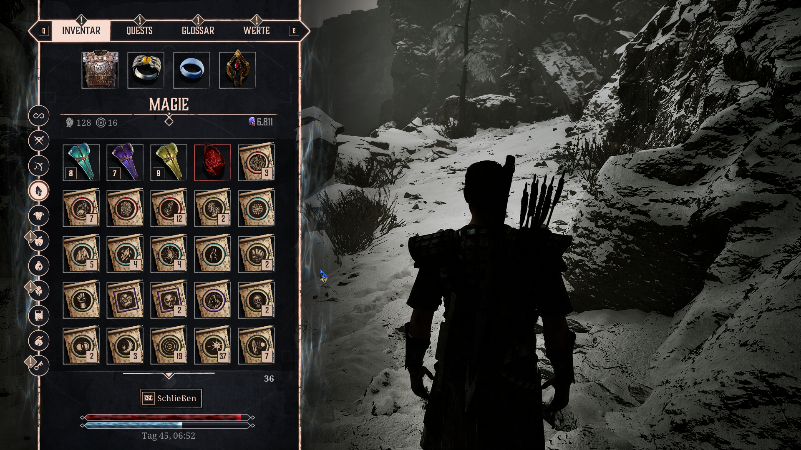
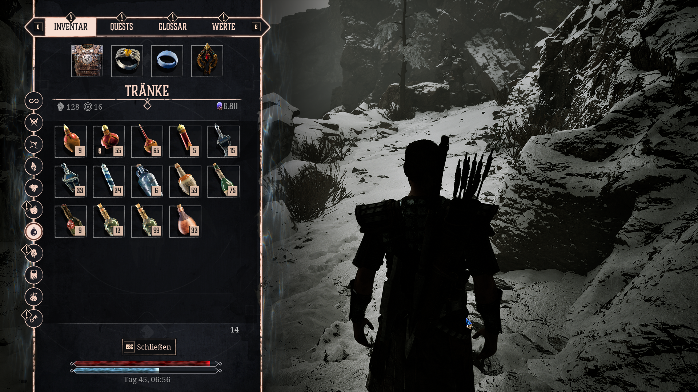

# Gothic 1 Remake – Inventory Sort

**English version below:** [Jump to the English instructions](#english)

Ein UE4SS-Lua-Mod für **Gothic 1 Remake**, der Gegenstände in den einzelnen
Inventar-Tabs übersichtlich sortiert.

**Version 2.5.0** sortiert das Spielerinventar sowie die Kaufen- und
Verkaufen-Tabs beim Händler. Gegenstände werden innerhalb ihrer Kategorien
nach Art und passenden Eigenschaften geordnet. Der Tab **Alle** bleibt in
seiner ursprünglichen Reihenfolge.

[Installations-ZIP für Version 2.5.0 herunterladen](https://github.com/Erzmaster/Gothic-1-Remake-Inventory-Sort/releases/download/v2.5.0/G1R_InventorySort-v2.5.0.zip)

## Vorschau

[▶ Demo-Video ansehen (MP4, ca. 169 MB)](assets/video/inventory-sort-demo.mp4)

| Nahkampfwaffen | Fernkampfwaffen |
| --- | --- |
|  |  |

| Magie | Tränke und Getränke |
| --- | --- |
|  |  |

## Voraussetzungen

- Gothic 1 Remake für Windows
- [UE4SS `experimental-latest`](https://github.com/UE4SS-RE/RE-UE4SS/releases/tag/experimental-latest)

## Installation

### 1. UE4SS installieren

1. Lade von der offiziellen
   [`experimental-latest`-Release-Seite](https://github.com/UE4SS-RE/RE-UE4SS/releases/tag/experimental-latest)
   das normale Paket `UE4SS_v...zip` herunter. Das mit `zDEV-` beginnende
   Entwicklerpaket wird für die Installation dieses Mods nicht benötigt.
2. Entpacke das UE4SS-Archiv in den Ordner, in dem sich
   `G1R-Win64-Shipping.exe` befindet. Bei Steam liegt er unter deiner
   Bibliothek, zum Beispiel:

   ```text
   <Steam-Bibliothek>\steamapps\common\Gothic 1 Remake\G1R\Binaries\Win64\
   ```

3. Danach sollte das für diesen Mod benötigte Verzeichnis ungefähr so
   aussehen:

   ```text
   Win64\
   ├── G1R-Win64-Shipping.exe
   ├── dwmapi.dll
   └── ue4ss\
       ├── Mods\
       └── UE4SS-settings.ini
   ```

   Einzelne UE4SS-Dateien können je nach verwendeter Version abweichen. Die
   offizielle allgemeine Anleitung befindet sich im
   [UE4SS Installation Guide](https://docs.ue4ss.com/installation-guide).

### 2. Inventory Sort installieren

Kopiere den vollständigen Ordner `G1R_InventorySort` nach:

```text
Gothic 1 Remake\G1R\Binaries\Win64\ue4ss\Mods\
```

Die Ordnerstruktur muss anschließend so aussehen:

```text
ue4ss\Mods\G1R_InventorySort\
├── enabled.txt
└── Scripts\
    ├── config.lua
    ├── inventory_port.lua
    ├── main.lua
    ├── sorter.lua
    └── trade_ui_port.lua
```

Wichtig: Es darf kein doppelter Unterordner wie
`G1R_InventorySort\G1R_InventorySort\Scripts` entstehen.

Die mitgelieferte `enabled.txt` aktiviert den Mod in der dafür ausgelegten
UE4SS-Konfiguration. Falls die verwendete UE4SS-Version stattdessen
`ue4ss\Mods\mods.txt` nutzt, ergänze dort diese Zeile:

```text
G1R_InventorySort : 1
```

Entferne vor der Installation ältere Kopien dieses Mods. Starte danach das
Spiel und öffne das Inventar. Wurde der Mod bei bereits geöffnetem Inventar
geladen, schließe und öffne das Inventar einmal neu.

## Funktionsweise

Die Sortierung wird beim Öffnen und Aktualisieren des Inventars automatisch
angewendet. Sie gilt auch für die Kaufen- und Verkaufen-Tabs beim Händler.
Ausgerüstete Gegenstände stehen im Spielerinventar zuerst. Innerhalb eines
Tabs folgen die Gegenstände den unten beschriebenen Sortierregeln.

Der Mod entfernt keine Gegenstände und verändert weder Mengen noch Preise.
Nicht eindeutig erkannte Gegenstände bleiben sichtbar und werden unter
**Andere** eingeordnet. Bei gleichen Sortierwerten bleibt ihre bisherige
Reihenfolge erhalten. Der gemischte Tab **Alle** wird nicht sortiert.

## Sortierlogik

Die folgenden Kriterien werden je Tab exakt von oben nach unten angewendet.
Die Reihenfolge in Klammern ist zugleich die Reihenfolge der Einzelwerte.

### Nahkampfwaffen

1. **Waffenart** (Zweihand → Einhand → Andere)
2. **Schaden** (absteigend)
3. **Name** (alphabetisch)

### Fernkampfwaffen

1. **Waffenart** (Armbrust → Bogen → Andere)
2. **Schaden** (absteigend)
3. **Name** (alphabetisch)

Pfeile, Bolzen und andere nicht als Bogen oder Armbrust erkannte Einträge
bleiben erhalten und gehören zu **Andere**.

### Magie

1. **Art** (Teleportstein → Rune → Schriftrolle → Andere)
2. **Magiekategorie** (Feuer → Eis → Energie/Blitz → Wind/Aufprall →
   Beschwörung → Zustand → Andere → Verwandlung → Nicht erkannt)
3. **Magiekreis** (absteigend)
4. **Maximaler Schaden** (absteigend)
5. **Name** (alphabetisch)

Die nicht elementaren Kategorien werden anhand sprachunabhängiger
Gegenstands-IDs gebildet:

- **Beschwörung:** beispielsweise Golem, Skelette und weitere
  `Summon.*`-Einträge
- **Zustand:** Angst, Freundlich stimmen, Kontrolle und Schlaf
- **Andere:** Heilung, Licht und Telekinese
- **Verwandlung:** alle `Transform.*`-Einträge

Ein Magiekreis wird nur berücksichtigt, wenn die Gegenstandsdefinition einen
positiven Wert für `RequiredMagicCircleLevel` bereitstellt. Fehlende Werte
werden nicht geschätzt.

### Kleidung und Schmuck

1. **Art** (Rüstung → Amulett → Ring → Andere)
2. **Name** (alphabetisch)

### Nahrung

1. **Art** (Fertiggericht → Nahrung → Kraut → Droge → Andere)
2. **Name** (alphabetisch)

### Tränke und Getränke

1. **Art** (Heiltrank → Manatrank → Misch-/Regenerationstrank →
   Getränk/Alkohol → Andere)
2. **Stärke** (absteigend)
3. **Sekundäre Stärke bei Mischtränken** (absteigend)
4. **Name** (alphabetisch)

Bei Heil- und Manatränken entspricht die Stärke dem jeweiligen
Wiederherstellungswert. Bei Mischtränken wird zuerst der Heilwert und danach
der Manawert verglichen; bei Getränken der bekannte Alkoholwert.

### Materialien

1. **Art** (Alchemierezept → Inschriftenrezept → Erz → Material → Trophäe →
   Andere)
2. **Name** (alphabetisch)

### Dokumente

1. **Art** (Schriftstück → Andere)
2. **Name** (alphabetisch)

### Verschiedenes

1. **Art** (Dietrich → Fackel → Instrument → Plunder → Andere)
2. **Name** (alphabetisch)

### Artefakte

1. **Art** (Questgegenstand → Schlüssel → Andere)
2. **Name** (alphabetisch)

### Alle Gegenstände

Der gemischte Tab **Alle Gegenstände** wird absichtlich nicht sortiert.

## Fehlerprüfung

In `ue4ss\UE4SS.log` sollte nach dem Spielstart unter anderem folgende Zeile
erscheinen:

```text
[G1R_InventorySort] v2.5.0 loaded; guarded inventory UI sorting is active
```

Fehlt sie, prüfe zuerst die Ordnerstruktur und die Aktivierung des Mods.
`sort failed` oder `trade UI sort failed` im Log bezeichnet eine abgebrochene
Sortierung; bewahre das Log und die betroffene Aktion für eine Fehlermeldung auf.

## Deinstallation

Beende das Spiel und entferne den Ordner `ue4ss\Mods\G1R_InventorySort`.
Falls du den Mod in `mods.txt` aktiviert hast, entferne auch diesen Eintrag.

## Lizenz

Dieses Projekt steht unter der [Apache License 2.0](LICENSE).

---

# English

This UE4SS Lua mod for **Gothic 1 Remake** sorts items in the individual
inventory tabs.

**Version 2.5.0** sorts the player inventory and the merchant's Buy and Sell
tabs. Items are grouped by type and ordered by relevant properties within
each category. The mixed **All Items** tab keeps its original order.

[Download the version 2.5.0 installation ZIP](https://github.com/Erzmaster/Gothic-1-Remake-Inventory-Sort/releases/download/v2.5.0/G1R_InventorySort-v2.5.0.zip)

## Media preview

[▶ Watch the demo video (MP4, approximately 169 MB)](assets/video/inventory-sort-demo.mp4)

| Melee weapons | Ranged weapons |
| --- | --- |
|  |  |

| Magic | Potions and beverages |
| --- | --- |
|  |  |

## Requirements

- Gothic 1 Remake for Windows
- [UE4SS `experimental-latest`](https://github.com/UE4SS-RE/RE-UE4SS/releases/tag/experimental-latest)

## Installation

### 1. Install UE4SS

1. From the official
   [`experimental-latest` release page](https://github.com/UE4SS-RE/RE-UE4SS/releases/tag/experimental-latest),
   download the regular `UE4SS_v...zip` package. The developer package whose
   name starts with `zDEV-` is not required for this mod.
2. Extract the UE4SS archive into the directory containing
   `G1R-Win64-Shipping.exe`. On Steam, it is under your library, for example:

   ```text
   <Steam library>\steamapps\common\Gothic 1 Remake\G1R\Binaries\Win64\
   ```

3. The directory required by this mod should then look approximately like
   this:

   ```text
   Win64\
   ├── G1R-Win64-Shipping.exe
   ├── dwmapi.dll
   └── ue4ss\
       ├── Mods\
       └── UE4SS-settings.ini
   ```

   Individual UE4SS files may differ depending on the release in use. Refer to
   the official [UE4SS Installation Guide](https://docs.ue4ss.com/installation-guide)
   for the general installation instructions.

### 2. Install Inventory Sort

Copy the complete `G1R_InventorySort` directory to:

```text
Gothic 1 Remake\G1R\Binaries\Win64\ue4ss\Mods\
```

The resulting directory structure must look like this:

```text
ue4ss\Mods\G1R_InventorySort\
├── enabled.txt
└── Scripts\
    ├── config.lua
    ├── inventory_port.lua
    ├── main.lua
    ├── sorter.lua
    └── trade_ui_port.lua
```

Important: Do not create a duplicated directory such as
`G1R_InventorySort\G1R_InventorySort\Scripts`.

The included `enabled.txt` activates the mod in UE4SS configurations that
support this marker. If the installed UE4SS release uses
`ue4ss\Mods\mods.txt` instead, add this line to that file:

```text
G1R_InventorySort : 1
```

Remove older copies of this mod before installation. Then start the game and
open the inventory. If the mod was loaded while the inventory was already
open, close and reopen the inventory once.

## How it works

Sorting is applied automatically when the inventory opens or refreshes. It
also works in the merchant's Buy and Sell tabs. Equipped items appear first
in the player inventory. Items within each tab follow the rules below.

The mod does not remove items or change quantities or prices. Items that
cannot be identified reliably remain visible under **Other**. Items with
equal sorting values keep their previous relative order. The mixed **All
Items** tab is left unchanged.

## Sorting rules

The criteria below are applied from top to bottom for each tab. Values in
parentheses are listed in their exact sorting order.

### Melee weapons

1. **Weapon type** (Two-handed → One-handed → Other)
2. **Damage** (descending)
3. **Name** (alphabetical)

### Ranged weapons

1. **Weapon type** (Crossbow → Bow → Other)
2. **Damage** (descending)
3. **Name** (alphabetical)

Arrows, bolts, and entries not identified as a bow or crossbow are preserved
and placed in **Other**.

### Magic

1. **Type** (Teleport Stone → Rune → Scroll → Other)
2. **Magic category** (Fire → Ice → Energy/Lightning → Wind/Impact → Summoning
   → Status effect → Other → Transformation → Unrecognized)
3. **Magic circle** (descending)
4. **Maximum damage** (descending)
5. **Name** (alphabetical)

Non-elemental categories are determined from language-independent item IDs:

- **Summoning:** for example Golem, Skeletons, and other `Summon.*` entries
- **Status effect:** Fear, Charm, Control, and Sleep
- **Other:** Heal, Light, and Telekinesis
- **Transformation:** all `Transform.*` entries

A magic circle is considered only if the item definition provides a positive
`RequiredMagicCircleLevel` value. Missing values are not estimated.

### Clothing and jewelry

1. **Type** (Armor → Amulet → Ring → Other)
2. **Name** (alphabetical)

### Food

1. **Type** (Prepared dish → Food → Herb → Drug → Other)
2. **Name** (alphabetical)

### Potions and beverages

1. **Type** (Healing potion → Mana potion → Mixed/Regeneration potion →
   Beverage/Alcohol → Other)
2. **Strength** (descending)
3. **Secondary strength for mixed potions** (descending)
4. **Name** (alphabetical)

For healing and mana potions, strength is the corresponding restoration
amount. Mixed potions are compared by healing amount first and mana amount
second; beverages use their known alcohol value.

### Materials

1. **Type** (Alchemy recipe → Inscription recipe → Ore → Material → Trophy →
   Other)
2. **Name** (alphabetical)

### Documents

1. **Type** (Writing → Other)
2. **Name** (alphabetical)

### Miscellaneous

1. **Type** (Lockpick → Torch → Instrument → Junk → Other)
2. **Name** (alphabetical)

### Artefacts

1. **Type** (Quest item → Key → Other)
2. **Name** (alphabetical)

### All items

The mixed **All Items** tab is intentionally left unchanged.

## Troubleshooting

After starting the game, `ue4ss\UE4SS.log` should contain a line similar to:

```text
[G1R_InventorySort] v2.5.0 loaded; guarded inventory UI sorting is active
```

If it is missing, check the directory structure and whether the mod is
enabled. A `sort failed` or `trade UI sort failed` line means sorting stopped;
retain the log and the affected action when reporting a bug.

## Uninstallation

Exit the game and remove the `ue4ss\Mods\G1R_InventorySort` directory.
Remove its `mods.txt` entry as well if you added one.

## License

This project is licensed under the [Apache License 2.0](LICENSE).
